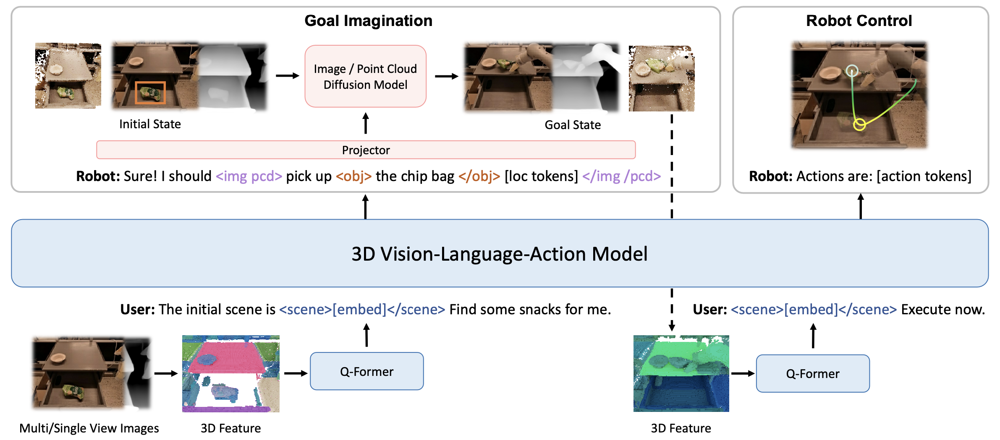

<br/>
<p align="center">
  <h1 align="center"><a style="color:#61a5c2;">3D</a>-<a style="color:#94D2BD;">V</a><a style="color:#EE9B00;">L</a><a style="color:#CA6502;">A</a>: A 3D Vision-Language-Action Generative World Model</h1>
  <p align="center">
    <a href="https://haoyuzhen.com">Haoyu Zhen</a>,
    <a href="">Xiaowen Qiu</a>,
    <a href="https://peihaochen.github.io">Peihao Chen</a>,
    <a href="https://github.com/Yang-Chincheng">Jincheng Yang</a>,
    <a href="https://cakeyan.github.io">Xin Yan</a>,
    <a href="https://yilundu.github.io">Yilun Du</a>,
    <a href="https://evelinehong.github.io">Yining Hong</a>,
    <a href="https://people.csail.mit.edu/ganchuang">Chuang Gan</a>
  </p>
  <p align="center">
    <a href="">
      
    </a>
    <a href='https://vis-www.cs.umass.edu/3dvla' style='padding-left: 0.5rem;'>
      
    </a>
  </p>
</p>

## Method
<p align="center">
    
</p>

## Citation
```
@article{3dvla,
  author = {Zhen, Haoyu and Qiu, Xiaowen and Chen, Peihao and Yang, Jincheng and Yan, Xin and Du, Yilun and Hong, Yining and Gan, Chuang},
  title = {3D-VLA: 3D Vision-Language-Action Generative World Model},
  journal = {arXiv},
  year = {2024},
}
```